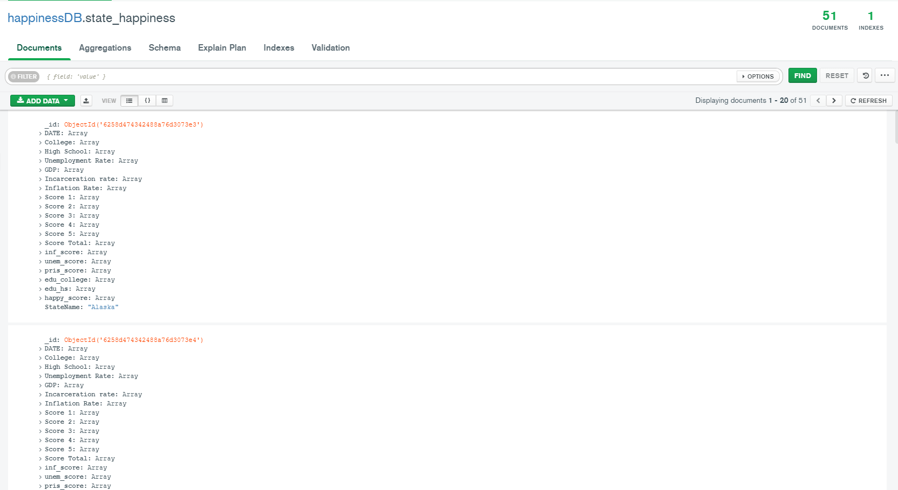

# Project Happiness
<p align="center">
  
</p>

Happiness is a rather novel metric that economists have attemped to measure since the early 1970s. For our Project Happiness we also took our interpretation of this metric and we created our own GNH index (Gross National Hapiness index). The eventual goal for this project would be for us to be able to forecast happiness for future dates utilizing machine learning.
- - -
## [Data Retrieval](data/original) & [Transformation](data)

For this process we webscraped a [website](https://www.usinflationcalculator.com/inflation/current-inflation-rates/) to obtain our overall inflation score, and the rest of the data primarily came from [Fred](https://fred.stlouisfed.org/) in .csv format and our crime dataset from [USAFacts](https://usafacts.org/state-of-the-union/crime/) was also tracked down to find the .csv that was used. From there the data was cleaned and transformed into the specific format that we desired to utilize in both .csv format and .json format.
- - -
## [Data Manipulation](code)
The primary module we used for this manipulation was Pandas to perfrom transposes and merging to consolidate all our data into a final [file](data/final_happy.csv) that was both converted into a .json file and was uploaded into our MongoDB. One of our biggest hurdles was getting all the data to iterate through all 50 states/D.C while simultaneously iterating through 10 years worth of data. Below is an example of one those loops.

```python
#Locate the first state in our data
gdp_data = pd.DataFrame(drop_gdp.loc["Alaska",:])

#container for loop appending
state_cont = []

#Loop to get repeating state name in column and setting up new loop
for x in range(len(gdp_data)):
    state_cont.append(gdp_data.columns[0])
gdp_data["GeoName"] = state_cont
gdp_data = gdp_data.set_index(["GeoName",gdp_data.index]) 
gdp_data.columns=["GDP"]

#Iterate through all states to get data in a preferred format for mongodb
for state in state_list:

    gdp_new = pd.DataFrame(drop_gdp.loc[state,:])

    state_cont = []

    for x in range(len(gdp_new)):
        state_cont.append(gdp_new.columns[0])
    gdp_new["GeoName"] = state_cont
    gdp_new = gdp_new.set_index(["GeoName",gdp_new.index])
    gdp_new.columns=["GDP"]
    gdp_data = gdp_data.append(gdp_new)
gdp_data  
```
## MongoDB
Specifically on the topic of our MongoDb, our data was fed in specifically to give every measured metric an array format to be able to create single pages for each state showing all data relevant to it. This allowed us to filter for states in our flask and automate the production process of each states dashboard.

